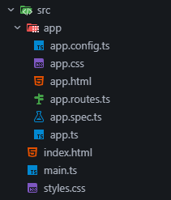

# Diplomatura en Profesional Full-Stack Developer

## Curso de desarrollo con Angular - Profesor: Gabriel Alberini

### Módulo 1: Angular

### Unidad 1: Conociendo Angular

### Consigna: Mi primera app en Angular

Comprender el flujo básico de trabajo en Angular, desde la creación de un proyecto hasta la visualización de datos en la vista,
considerando su estructura y comandos básicos de Angular CLI.

### Estructura inicial de un proyecto de Angular iniciado con CLI.

```bash
npm install -g @angular/cli

ng new <proyect-name>

```

<table>
 <thead>
  <tr>
   <th style="font-weight: bold;">Estructura principal de carpetas y archivos</th>
   <th style="font-weight: bold;">Descripción</th>
  </tr>
 </thead>
 <tbody>  
  <tr>
   <td>
    
   </td>
   <td>
    <ul>
     <li> src/ - Código fuente de la aplicación</li>
     <li> src/app/ - Componentes, rutas y lógica principal</li>
      <ul>
        <li> app.config.ts - Proveedores e Inyectores globales</li>
        <li> app.css - Estilos específicos del componente raíz</li>
        <li> app.html - Vista HTML del componente raíz</li>
        <li> app.routes.ts - Configuración de rutas de navegación</li>
        <li> app.spec.ts - Pruebas unitarias del componente raíz</li>
        <li> app.ts - Componente raíz (Lógica)</li>
     </ul>
    <li> index.html - Página HTML principal</li>
    <li> main.ts - Punto de entrada de la aplicación</li>
    <li> styles.css - Estilos globales de la app</li>
   </ul>
  </td>
 </tr>
 </tbody>
</table>

### Como ejecutar la tarea:

1. Clonar el repositorio:

```bash
git clone https://github.com/Diplomatura-Full-Stack-Developer/Angular-M1-T1

```

2. Instalar las dependencias:

```bash
npm install
```

3. Ejecutar la aplicación:

```bash
ng serve
```

### Recursos utilizados en la tarea:

- Angular ([https://angular.dev/](https://angular.dev/))
- Angular CLI - Versión 22.1.7 ([https://angular.io/cli](https://angular.io/cli))
- Node.js - Versión 24.20.0 ([https://nodejs.org/es/download/](https://nodejs.org/es/download/))

### Alumno: Rubén Seco

### Comisión: 181802
